# Guia estelar HTTP

## HyperText Transfer Protocol

protocolo de transferência de HyperTexto

### Visão Geral

- Permite troca de informação e dados na internet
- Uma troca de mensagens
- HTML, CSS, Script, Imagem, Video
- Uma chamada para cada um desses recursos

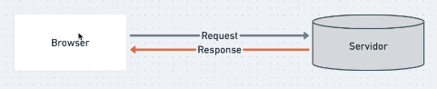

## Mensagem

### Pedido(Request)

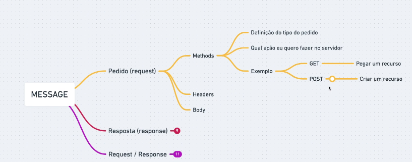

### REQUEST MESSAGE

~~~~code
GET /index.html HTTP/1.1
User-Agent: Mozilla/4.0
Accept:text/html
~~~~

### Resposta(Response)

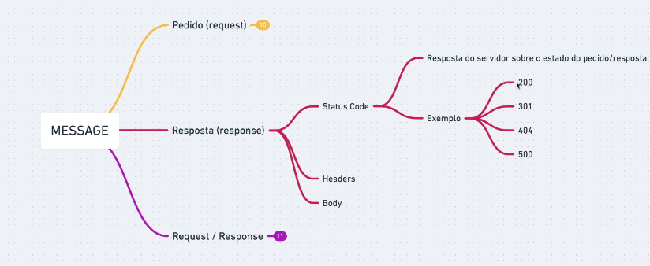

### RESPONSE MESSAGE

~~~~code
HTTP/1.1 200 OK
Server:Express
Content-Type: text/html
~~~~

### header

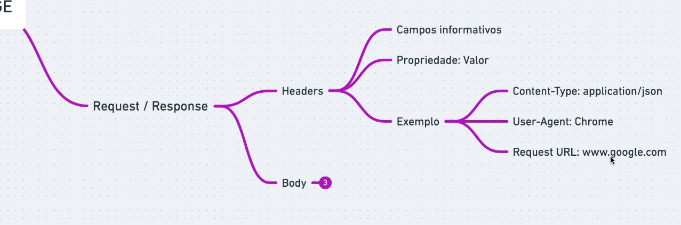

### body

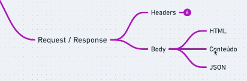

## Recurso

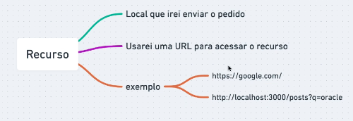

## curl

~~~~bash
curl -i https://google.com # retorna requisição com informação do HEADER

curl -v https://google.com # retorna requisição com todas as informações
~~~~

## conceitos

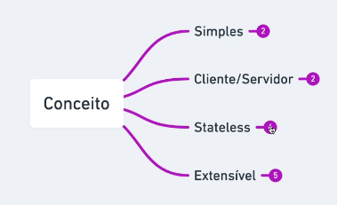

## cliente

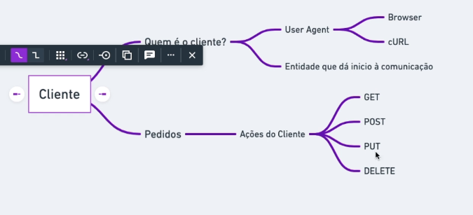

## servidor

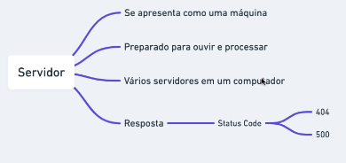

## json-server

~~~~bash
npm install -g json-server
~~~~

## Methods

### options

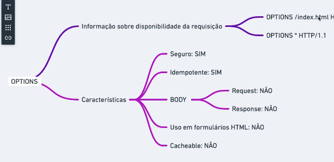

~~~~bash
curl -X OPTIONS http://localhost:3000/posts -i # faz uma chamada do tipo options
~~~~

### get

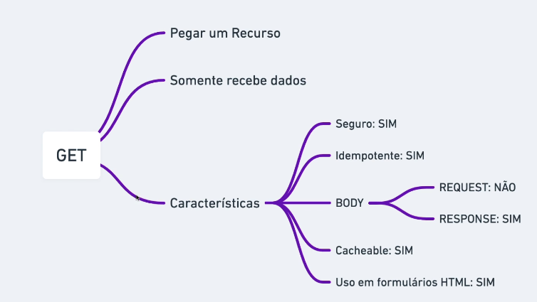

~~~~bash
curl http://localhost:3000/posts # recebe a resposta do tipo GET
~~~~

### head

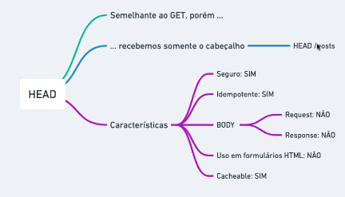

Vem somente o cabeçalho.

~~~~bash
curl -I  http://localhost:33000/posts
~~~~

### post

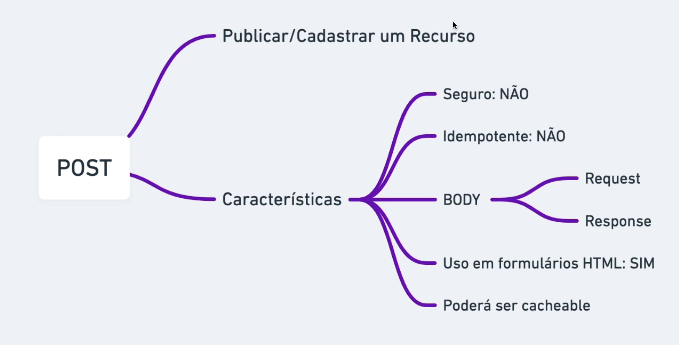

~~~~bash
d '{"id": 2, "title": "json-server", "author": "typicode"}' -H "Contet-type: application/json" -X POST  http://localhost:3000/posts # resposta do tipo POST
~~~~

### put

muda o recurso par Inteiro

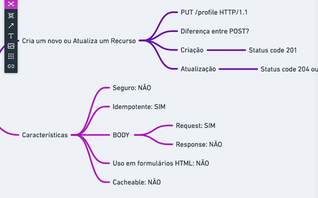

~~~~bash
curl  -d '{"name":"nicolas"}' -H 'Content-type: application/json' -X PUT  http://localhost:3000/profile
~~~~

### patch

muda parte do recurso

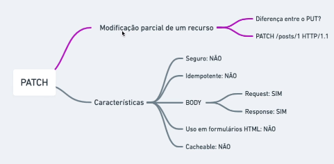

~~~~bash
curl -d '{"title":"my-title"}' -H "Content-type: application/json" -X PATCH  http://localhost:3000/posts/1
~~~~

### delete

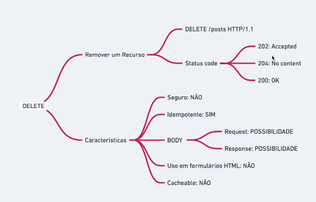

~~~~bash
curl -X DELETE  http://localhost:3000/posts/2
~~~~

## headers

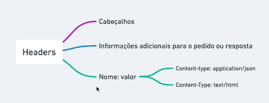

### header-contexto

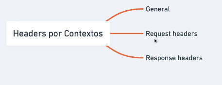

## status code

### 100

- 100: Continue

### 200

- 200: OK (GET,POST)
- 201: Created (PUT)
- 204: No Content (DELETE,PUT)

### 300

- 301: Moved Permanently
- 308: Permanent Redirect
- 302: found
- 307: Temporary Redirect

### 400

- 400: Bad Request
- 401: Unauthorized
- 403: Forbiden
- 404: Not Found
- 405: Method Not Allowed
- 429: Too Many Request

### 500

- 500: internal Server Erros
- 503: Service Unavalible
